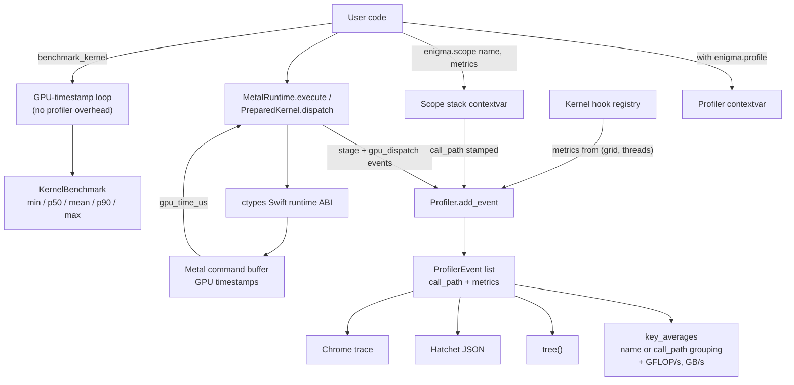

# Enigma Profiler

Proton-style profiling for Enigma Metal kernels: hierarchical scopes, custom
metrics with derived throughput, kernel launch hooks, call-tree and Hatchet
output, and an unbiased GPU-timestamp benchmark helper. Profiling never
changes generated MSL, and every API is a no-op when no profiler is active.

## Quick Start

```python
import enigma
import numpy as np

@enigma.kernel
def vector_add(A: enigma.f32, B: enigma.f32, C: enigma.f32):
    tid = enigma.thread_position_in_grid
    C[tid] = A[tid] + B[tid]

compiled = enigma.compile(vector_add)
rt = enigma.MetalRuntime()
n = 1 << 20
a = np.random.randn(n).astype(np.float32)
b = np.random.randn(n).astype(np.float32)

with enigma.profile() as prof:
    with enigma.scope("step", metrics={"bytes": 12.0 * n}):
        rt.execute(compiled, [a, b], n * 4, grid=(n, 1, 1), threads=(256, 1, 1))

print(prof.key_averages().table(sort_by="gpu_total_us"))
print(prof.tree())
prof.export_hatchet("profile.json")     # call tree (Hatchet literal format)
prof.export_chrome_trace("trace.json")  # chrome://tracing / Perfetto
```

## How It Works

1. `enigma.profile()` installs a `Profiler` in a contextvar. The runtime
   checks that contextvar once per call; when empty, dispatch takes the
   untimed fast path and nothing is allocated — the disabled profiler is
   free.
2. `enigma.scope(name, metrics=...)` pushes `name` onto a contextvar scope
   stack and records one event on exit. Scopes nest; the stack is the call
   path.
3. Runtime events are recorded by `MetalRuntime.execute` (one event per
   stage: `load_library`, `create_pipeline`, `create_input_buffers`,
   `create_output_buffers`, `gpu_dispatch`, `read_output`,
   `release_resources`, `execute_total`) and by
   `PreparedKernel.dispatch` (`gpu_dispatch` + `prepared_dispatch`). When a
   profiler is active the dispatch goes through the Swift runtime's timed
   path, which reads Metal command-buffer GPU timestamps — so
   `gpu_time_us` is GPU time, not CPU wall clock.
4. Profiled dispatches also record **phase timings** in the `gpu_dispatch`
   event's metadata (visible in Chrome traces and `events()`):
   - `scheduling_us` — CPU-side command scheduling
     (`kernelEndTime - kernelStartTime`)
   - `queue_wait_us` — commit-to-GPU-start latency
   - `encoder_gpu_us` — encoder GPU time from `MTLCounterSampleBuffer`
     stage-boundary timestamp sampling (only on devices where
     `runtime.supports_stage_counters()` is true; converted from GPU ticks
     via `MTLDevice.sampleTimestamps` correlation)
5. Profiled `gpu_dispatch` events also carry **pipeline insight** metadata
   from the compiled pipeline state:
   - `max_threads_per_threadgroup`, `thread_execution_width`,
     `static_threadgroup_memory_bytes`
   - `threadgroup_occupancy` — your threadgroup size divided by the
     pipeline's `maxTotalThreadsPerThreadgroup`; values well below 1.0
     suggest the launch configuration underfills the pipeline's limit
6. `Profiler.add_event` stamps the current scope stack onto each incoming
   event (`call_path`) and runs any registered kernel hook to attach metrics.
7. Aggregation (`key_averages`), the call tree (`tree`), and the exporters
   all read the same event list.

### One-shot vs prepared dispatch

`execute()` is one-shot: its table includes library load, pipeline creation,
buffer creation, readback, and release. `PreparedKernel.dispatch()` reuses
all of that. Never compare an `execute_total` row against a
`prepared_dispatch` row as if they measure the same thing.

## Scopes, Metrics, Derived Throughput

Attach semantic work counts to a scope and the profiler derives throughput
from measured GPU time:

```python
with enigma.profile() as prof:
    with enigma.scope("gemm", metrics={"flops": 2 * M * N * K,
                                       "bytes": 4 * (M * K + K * N + M * N)}):
        prepared.dispatch(grid, threads)

print(prof.key_averages().table())   # gains GFLOP/s and GB/s columns
```

Metric names `flops` and `bytes` are the conventions used for derivation;
any other keys are carried through to exports untouched.

## Kernel Hooks

Register the work formula once; every profiled dispatch of that kernel gets
metrics automatically (Proton's `launch_metadata` equivalent):

```python
enigma.register_kernel_hook(
    "gemm_kernel",
    lambda *, kernel_name, grid, threads: {
        "flops": 2.0 * M * N * K,
        "bytes": 4.0 * (M * K + K * N + M * N),
    },
)
...
enigma.unregister_kernel_hook("gemm_kernel")
```

## Call-Path Analysis

The same kernel called from different contexts stays distinguishable:

```python
with enigma.profile() as prof:
    with enigma.scope("attention"):
        gemm_prepared.dispatch(grid, threads)
    with enigma.scope("mlp"):
        gemm_prepared.dispatch(grid, threads)

print(prof.key_averages(group_by="call_path").table())
# attention/gpu_dispatch:gemm_kernel ...
# mlp/gpu_dispatch:gemm_kernel ...
print(prof.tree())
```

`export_hatchet("profile.json")` writes the same tree as Hatchet literal
JSON — load it with `hatchet.GraphFrame.from_literal(json.load(f))` to query
hotspots or diff two profiles.

## Unbiased Benchmarking on Unified Memory

Apple Silicon shares one physical memory between CPU and GPU. That kills
explicit transfers but creates two biases:

- **Cold-start bias:** the first dispatches pay pipeline creation, driver
  work, and page-residency costs. Timing them overstates kernel cost.
- **Warm-cache bias:** after a few iterations the working set is resident in
  the shared cache hierarchy, so tight repeat loops on small buffers report
  bandwidth no cold-data workload will see. If you are measuring DRAM
  bandwidth, size the working set well beyond the chip's last-level cache.

`enigma.benchmark_kernel` is built around these constraints:

```python
prepared = rt.prepare(compiled, [a, b], n * 4)
bench = enigma.benchmark_kernel(
    prepared,
    grid=(n, 1, 1), threads=(256, 1, 1),
    repeat=100, warmup=10,
    flops=None, bytes_moved=12.0 * n,
)
print(bench.summary())
# vector_add: 100 calls  min 6.91us  p50 7.12us  mean 7.40us  p90 8.05us  max 12.3us  176.40 GB/s (p50)
prepared.release()
```

- Times come from **Metal GPU timestamps only**; no profiler events, no
  Python timing inside the measured region.
- Warmup runs on the untimed fast path.
- The full distribution is reported. Compare kernels by **median** (robust
  to thermal/scheduler outliers); `min` is best-case; `p90` exposes tail
  variance. A single mean is never the right number on a machine whose CPU
  shares bandwidth with the GPU.

Use `benchmark_kernel` to compare kernels; use `profile_kernel` /
`enigma.profile()` to understand where time goes.

## Xcode GPU Capture (`.gputrace`)

For intra-kernel analysis (instruction mix, memory traffic, occupancy
timelines), hand the profiled region to Xcode's GPU debugger:

```bash
MTL_CAPTURE_ENABLED=1 python my_script.py
```

```python
rt = enigma.MetalRuntime()                      # registers the capture backend
with enigma.profile(capture="run.gputrace") as prof:
    prepared.dispatch(grid, threads)
# open run.gputrace in Xcode
```

- The path must end in `.gputrace` (`ValueError` otherwise).
- Capture starts when the `profile()` context enters and stops when it
  exits; everything dispatched inside is in the trace.
- Without `MTL_CAPTURE_ENABLED=1` (or before any `MetalRuntime` exists)
  entering the context raises `RuntimeError` — capture never fails
  silently.

## Architecture



## API Summary

| API | Purpose |
|---|---|
| `enigma.profile(record_shapes=False, profile_memory=False, capture=None)` | Profiler context manager; `capture="x.gputrace"` records an Xcode GPU trace |
| `enigma.scope(name, metrics=None, category="scope", **meta)` | Nested named region with optional metrics |
| `enigma.record_function(name, ...)` | Alias of `scope` with `category="python"` |
| `enigma.register_kernel_hook(kernel_name, fn)` / `unregister_kernel_hook` | Auto-metrics per dispatch |
| `prof.key_averages(group_by="name"\|"call_path")` | Aggregated rows; `.table(sort_by=...)` |
| `prof.tree()` | Rendered call-path tree |
| `prof.export_hatchet(path)` | Hatchet literal JSON |
| `prof.export_chrome_trace(path)` | Chrome/Perfetto trace |
| `enigma.profile_kernel(prepared, ...)` | Stage-level repeated-dispatch inspection |
| `enigma.benchmark_kernel(prepared, ...)` | Unbiased steady-state GPU timing (`KernelBenchmark`) |

## Testing

- `tests/test_profiler.py` (no GPU needed; fake runtime lib): disabled
  profiler is a no-op, scope nesting and call-path inheritance, metric
  derivation and conditional table columns, hooks, `group_by="call_path"`,
  tree rendering, Hatchet/Chrome export structure, `benchmark_kernel`
  timestamp-only behavior and argument validation.
- `tests/metal/test_profiler_runtime.py` (requires Metal + MLIR bindings):
  real dispatch records positive GPU time with correct grid/threads/bytes,
  scope + hook integration on hardware, and `benchmark_kernel` distribution
  sanity (min ≤ p50 ≤ max, positive derived bandwidth).

Run them with:

```bash
python -m pytest tests/test_profiler.py tests/metal/test_profiler_runtime.py
```
