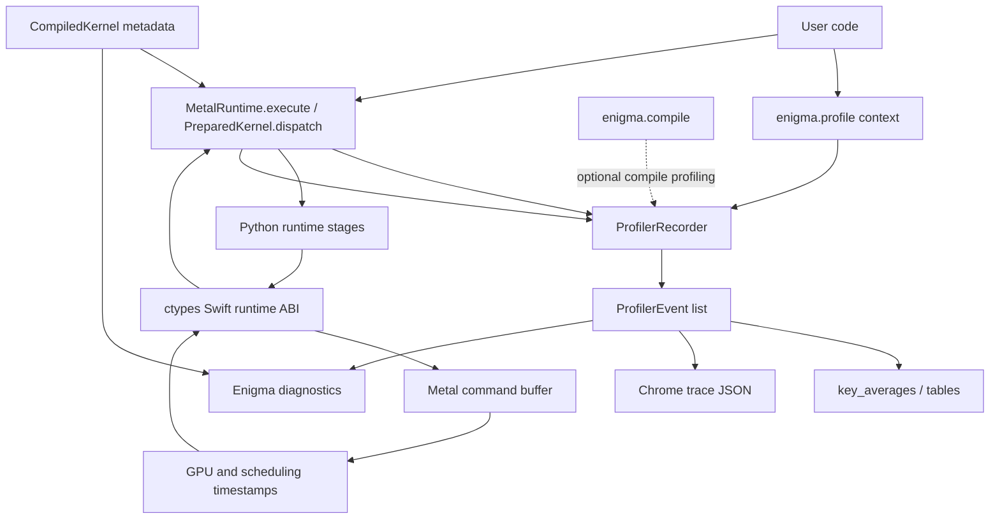

# Enigma Profiler Design

Date: 2026-05-23
Status: Draft
Scope: Enigma-DSL runtime profiler, with future Metal/Xcode capture integration

## Context

Enigma is an early Apple GPU DSL. Its profiler should not be a generic timer
wrapper. It should help users understand Enigma kernels in Apple-specific terms:
Metal command buffers, generated MSL, simdgroups, threadgroups, shared storage,
pipeline creation, buffer materialization, readback, and layout-driven kernels.

The current codebase already has the important V1 hook points:

- `enigma.runtime_dispatch.runtime.MetalRuntime.execute`
- `enigma.runtime_dispatch.runtime.MetalRuntime.prepare`
- `enigma.runtime_dispatch.runtime.PreparedKernel.dispatch`
- `enigma.runtime_dispatch.runtime.PreparedKernel.dispatch_timed`
- `enigma.runtime_dispatch.swift.libenigma_runtime.swift`
- `enigma.benchmark`
- `enigma.compiler.compiler.compile`

The Swift runtime already exposes a timed dispatch path that reads Metal command
buffer GPU timestamps. The Python benchmark layer already uses that path for
repeat/warmup timing. The profiler should build on these hooks rather than
injecting instrumentation into generated kernels.

Enigma is also not a traditional app render loop. There is no drawable,
presentation boundary, or Xcode project-level frame capture by default. The
profiler should treat each DSL dispatch as the meaningful unit of work and add
Metal labels/capture scopes around command buffers created by Enigma's runtime.

## Goals

V1 should provide a trustworthy low-overhead profiler for Enigma kernels.

It must answer:

- Which Enigma kernel ran?
- How long did the GPU command take?
- How much host time did the full call take?
- How much time was spent outside the GPU command, such as pipeline creation,
  buffer creation, encoding, and readback?
- What grid and threadgroup shape was used?
- How much input and output memory was involved?
- Was the result a one-shot dispatch or a preallocated prepared dispatch?
- Can the user export a Chrome trace for visual inspection?

V1 should not attempt to be a full Xcode Metal debugger replacement.

V1 should be the default profiler users can trust in notebooks, scripts,
examples, CI-capable emit-only environments, and local Apple Silicon runs.

## Non-Goals For V1

- No generated-kernel source instrumentation.
- No GPU counter sampling.
- No automatic Xcode launch.
- No default `.gputrace` capture.
- No claims of occupancy, cache behavior, or memory bandwidth unless the
  profiler has enough structured input to compute it honestly.
- No hidden profiling mode that changes kernel codegen or storage mode.
- No dependency on an enclosing macOS/iOS application frame.

## User-Facing API

Recommended V1 API:

```python
import enigma

with enigma.profile(record_shapes=True, profile_memory=True) as prof:
    with enigma.record_function("rmsnorm forward"):
        runtime.execute(
            compiled,
            [x, w],
            output_size=out_nbytes,
            grid=compiled.grid,
            threads=compiled.block,
        )

print(prof.key_averages().table(sort_by="gpu_time_total_us"))
prof.export_chrome_trace("enigma_trace.json")
```

Prepared dispatches should be captured too:

```python
prepared = runtime.prepare(compiled, [a, b], output_size)

with enigma.profile() as prof:
    for _ in range(100):
        prepared.dispatch(grid, threads)

print(prof.key_averages().table())
```

Benchmark-compatible path:

```python
result = enigma.profile_kernel(
    prepared,
    grid=grid,
    threads=threads,
    repeat=100,
    warmup=20,
)
print(result.table())
```

## V1 Event Model

The profiler records structured events. Each event has:

- `name`
- `category`
- `start_ns`
- `end_ns`
- `duration_us`
- `kernel_name`
- `grid`
- `threads`
- `input_bytes`
- `output_bytes`
- `buffer_count`
- `metadata`

Core event categories:

- `python`: user scopes from `record_function`
- `compile`: optional compile stages
- `runtime`: Python runtime work
- `metal`: Metal command execution
- `memory`: buffer materialization and readback

Runtime event names:

- `load_library`
- `create_pipeline`
- `create_input_buffers`
- `create_output_buffers`
- `encode_dispatch`
- `gpu_dispatch`
- `read_output`
- `release_resources`
- `execute_total`
- `prepared_dispatch`

## V1 Timing Semantics

The profiler must clearly separate:

- Compile time
- Library load time
- Pipeline creation time
- Input buffer materialization time
- Output buffer allocation time
- Command encoding time
- GPU execution time
- Output readback time
- Total wall time

This separation is more important than a single headline number. On Apple
Silicon, shared memory reduces some copy costs, but it does not remove memory
traffic, synchronization, allocator effects, CPU/GPU contention, or readback
costs.

## V1 Metal API Use

V1 should use only stable low-overhead Metal runtime information already close
to the dispatch path:

- `MTLCommandBuffer.gpuStartTime`
- `MTLCommandBuffer.gpuEndTime`
- `MTLCommandBuffer.kernelStartTime`
- `MTLCommandBuffer.kernelEndTime`
- `MTLCommandBuffer.status`
- `MTLCommandBuffer.error`
- `MTLCommandBuffer.label`
- `MTLComputeCommandEncoder.label`

These APIs fit Enigma's DSL/runtime model because they are available on the
command buffers Enigma already creates. V1 should not require an app frame,
drawable presentation, Instruments session, or Xcode-attached process.

The Swift runtime should expose a richer C ABI for one dispatch measurement:

```c
struct EnigmaDispatchMetrics {
    double gpu_time_us;
    double gpu_start_time_s;
    double gpu_end_time_s;
    double kernel_start_time_s;
    double kernel_end_time_s;
    int32_t status;
    int32_t error_code;
};
```

The exact ABI can be implemented as out-parameters for C/ctypes simplicity.
Python should convert it into an immutable dataclass.

## Architecture



## Module Layout

Suggested V1 files:

- `enigma/profiler.py`
- `enigma/runtime_dispatch/runtime.py`
- `enigma/runtime_dispatch/swift/libenigma_runtime.swift`
- `enigma/benchmark.py`
- `tests/test_profiler.py`
- `tests/metal/test_profiler_runtime.py`
- `docs/api-reference.md`

Public exports from `enigma/__init__.py`:

- `profile`
- `record_function`
- `Profiler`
- `ProfilerEvent`
- `ProfilerResult`

## Data Structures

```python
@dataclass(frozen=True)
class ProfilerEvent:
    name: str
    category: str
    start_ns: int
    end_ns: int
    kernel_name: str | None = None
    grid: tuple[int, int, int] | None = None
    threads: tuple[int, int, int] | None = None
    input_bytes: int = 0
    output_bytes: int = 0
    metadata: dict[str, object] = field(default_factory=dict)

@dataclass(frozen=True)
class DispatchMetrics:
    gpu_time_us: float
    gpu_start_time_s: float
    gpu_end_time_s: float
    kernel_start_time_s: float
    kernel_end_time_s: float
    status: int
```

`ProfilerResult.key_averages()` should group by event name and kernel name.
The default table columns should be:

- Name
- Calls
- CPU total
- CPU avg
- GPU total
- GPU avg
- Input bytes
- Output bytes

## Performance Model

V1 profiling should have near-zero overhead when disabled.

Disabled mode:

- No event object allocation.
- No stack inspection.
- No shape walking.
- No trace serialization.
- Existing dispatch path remains the default.

Enabled mode:

- Python adds stage timers around runtime work.
- Swift returns command buffer timing metadata.
- Optional shape and memory accounting walks Python inputs.
- Chrome trace serialization happens only when explicitly requested.

The GPU kernel itself is not modified. The generated MSL is unchanged. That is
the main reason V1 should not perturb kernel execution performance.

There will still be measurement overhead around host runtime code. The profiler
should document that `execute_total` includes profiling overhead while
`gpu_dispatch` comes from Metal command buffer timestamps.

Expected V1 impact:

- Disabled: no measurable kernel or dispatch-path overhead.
- Enabled, prepared dispatch: small Python bookkeeping overhead plus structured
  dispatch metrics returned from Swift.
- Enabled, one-shot `execute`: overhead is usually hidden by library load,
  pipeline creation, buffer creation, and readback, but those stages are exactly
  what the profiler reports.

## Caveats

### Unified Memory

Apple Silicon has unified memory, but profiler output must not imply that memory
movement is free. Shared memory can still be affected by:

- CPU/GPU contention for memory bandwidth.
- CPU reads or writes near GPU execution.
- Cache effects.
- Page residency and allocation behavior.
- Memory pressure from other processes.
- Thermal and power state changes.
- Output readback dominating small kernels.

V1 should report bytes and timing buckets. It should avoid claiming exact memory
bandwidth unless the caller passes an explicit byte model or the profiler has a
known kernel model.

### `storageModeShared`

The current Swift runtime creates buffers using shared storage. On Apple
Silicon, shared resources are CPU/GPU accessible system memory, but the exact
cost depends on how the buffer is created and whether data is copied into a new
Metal allocation.

V1 should measure buffer creation separately from GPU dispatch so users can see
when one-shot execution is dominated by buffer materialization.

### One-Shot Versus Prepared Dispatch

`MetalRuntime.execute` includes library load, pipeline creation, buffer
creation, dispatch, readback, and release.

`PreparedKernel.dispatch` reuses library, pipeline, and buffers.

Profiler tables must make this visible. Comparing `execute` against
`PreparedKernel.dispatch` as if they measure the same thing is misleading.

### Pipeline Creation

Pipeline creation may be expensive and may include driver work. It should be
reported as a separate event. Benchmarks should normally use `prepare` and warmup
when comparing kernel codegen performance.

### Asynchrony

The current runtime waits for command completion. V1 can assume blocking
dispatch. If Enigma later adds async dispatch, profiler scopes will need a
different lifetime model because Python scope exit may happen before GPU
completion.

### Stack Traces

Stack capture is useful, but it adds overhead. If added in V1, it should be
disabled by default behind `with_stack=True`.

### Metal API Availability

Metal timestamp fields can be unavailable or zero in some error states. The
Swift runtime should return status/error metadata and Python should avoid
turning missing timing into a fake zero-duration success.

### DSL Runtime, Not App Runtime

Many Metal debugging docs assume an app with frames, drawables, and render
passes. Enigma V1 should avoid frame language in public APIs. The unit is a
kernel dispatch or user-named profiling scope.

## V2: Metal/Xcode Capture

V2 should integrate with Apple tooling without making it the default path.

Possible API:

```python
with enigma.profile(capture="rmsnorm.gputrace"):
    runtime.execute(...)
```

V2 should add:

- Programmatic Metal capture via `MTLCaptureManager`.
- Optional `.gputrace` output.
- Capture scopes around selected command buffers.
- Command buffer and encoder debug groups.
- Source-preserving build mode for generated `.metal`.
- Clear error messages when capture is unavailable.

V2 should remain opt-in because capture can be heavy, toolchain-dependent, and
debugger-oriented.

V2 caveats:

- Capture must begin before the relevant Enigma command buffer is created.
- Capture must stop after the command buffer is committed.
- `.gputrace` output should use the proper file extension so Xcode can replay
  it.
- Generated `.metal` source should be preserved when users want shader-level
  debugging.
- Capture should never be silently enabled by normal benchmarking helpers.

## V3: Enigma Kernel Insight

V3 should use Enigma-specific compiler and layout knowledge.

Possible diagnostics:

- MLIR op count.
- Generated MSL source size.
- Kernel argument count and byte sizes.
- Threadgroup memory usage estimate.
- Simdgroup op usage.
- Async-copy usage.
- Function constant usage.
- Grid/block occupancy-like hints.
- TV layout metadata for `@jit` kernels.
- Arithmetic intensity estimates for known kernels.
- Warnings when readback, pipeline creation, or memory materialization dominates.

This is where Enigma can become more useful than a generic profiler: it can
connect Python DSL intent to generated MSL and Metal runtime behavior.

## Testing Strategy

Unit tests:

- Disabled profiler has no visible behavior changes.
- `record_function` creates nested Python events.
- `key_averages()` groups and sorts events.
- Chrome trace export emits valid JSON.
- Memory accounting handles NumPy arrays and byte outputs.

Metal runtime tests:

- `runtime.execute` records one GPU dispatch event.
- `PreparedKernel.dispatch` records one prepared dispatch event.
- GPU time is positive on supported Metal hosts.
- Grid and threads metadata match the call.
- Errors still propagate with profiling enabled.

Performance tests:

- Disabled profiler does not allocate events.
- Enabled profiler overhead is bounded for repeated prepared dispatches.
- Generated MSL source is identical with profiler disabled and enabled.

## Rollout Plan

1. Add Python profiler core with no runtime integration.
2. Instrument `MetalRuntime.execute` and `PreparedKernel.dispatch`.
3. Extend Swift timed dispatch ABI to return structured metrics.
4. Add Chrome trace export.
5. Add documentation and examples.
6. Add V2 capture design after V1 stabilizes.

## Recommended Decisions

- Compile-stage profiling should be opt-in through `profile_compile=True`.
  Runtime profiling should stay focused on dispatch behavior by default.
- The primary API should be `with enigma.profile()`. Avoid
  `runtime.execute(..., profile=True)` in V1 so profiling stays orthogonal to
  runtime execution.
- `profile_kernel` should live in `enigma.profiler` and may be re-exported from
  `enigma.benchmark` later if it proves useful for examples.
- V1 should include NumPy byte accounting. MLX byte accounting should be added
  if the existing MLX interop helper can report it without forcing evaluation or
  synchronization.

## References

- PyTorch profiler concepts: context manager, `record_function`,
  `key_averages`, memory profiling, stack traces, and Chrome trace export.
- Apple Metal command buffer debugging: command buffer labels, debug groups,
  status, errors, CPU scheduling timestamps, and GPU timestamps.
- Apple Metal capture APIs: `MTLCaptureManager`, capture descriptors, capture
  scopes, and `.gputrace` output.
- Apple Metal shared storage: CPU/GPU accessible shared resources and explicit
  synchronization responsibility.
